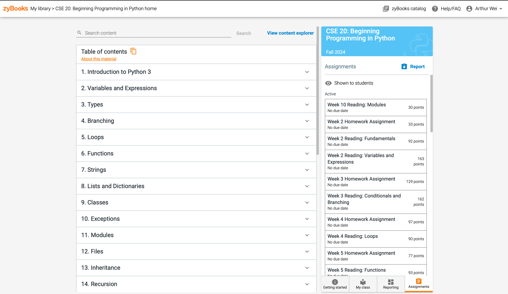
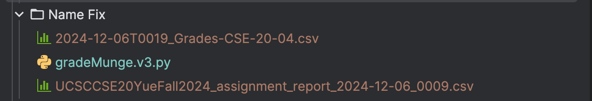
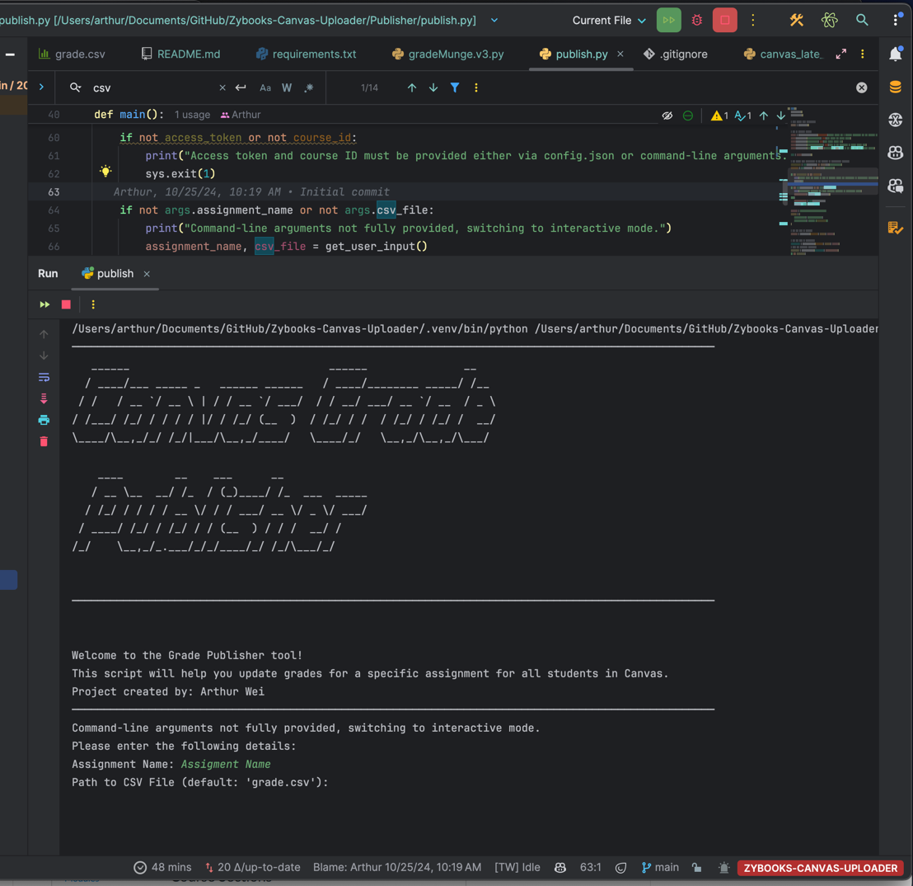

# Zybooks to Canvas Grader

This program is designed to help instructors grade assignments from Zybooks and publish the grades to Canvas. The tool
processes a CSV file containing student grades and publishes them to the Canvas gradebook.

## Requirements

- **Python 3.x**
- Required Libraries:
    - `pyfiglet`
    - `argparse`
    - `requests`

You can install the required dependencies using the following command:

```bash
pip install -r requirements.txt
```

---

## Usage

### Sanitize CSV File

Before using the main program, you must sanitize the CSV file. This ensures that the student names match correctly
between Zybooks and Canvas, avoiding any issues during grading.

#### Steps to Sanitize the CSV File:

1. **Download the CSV file from Zybooks:**
    - Navigate to the **front page** of the Zybooks course.
      
    - In the left sidebar, click the **"Assignments"** tab at the bottom.
    - Click the blue **"Report"** button to download a CSV file containing student grades.
      
    - The file will start with "UCSCCSE" and include the course name in the filename.
    - Move the downloaded file to the **"Name Fix"** directory in your project environment.
    - If you want to download reports dated for a specific date in the past, Click on reporting and select the date then check the box for each assignment you want to download.
    - Click on the download button to download the report.
    
      
     

2. **Download the CSV file from Canvas:**
    - Navigate to the **Canvas course** and click the **"Grades"** tab in the left sidebar.
      
    - Click the **"Export"** button in the top-right corner and select **"Export Entire Gradebook"** from the dropdown.
      
    - The file will be named with the current year. Move the downloaded file to the **"Name Fix"** directory.

3. **Verify your directory structure:**
    - Ensure the "Name Fix" directory contains both files:
      

4. **Run the sanitization script:**
    - Run the following command:

   ```bash
   python NameFix/gradeMunge.v3.py
   ```

5. **Review the output:**
    - Two new folders will be created in the "Name Fix" directory:
        - **oldzybooks:** Stores the original Zybooks file as a backup.
        - **output:** Contains the sanitized files.
            - `canvas_graded_output.csv`: The sanitized file ready for Canvas.
            - `unmatched_emails.csv`: Lists emails that could not be matched.
            - `updated_zybooks.csv`: The Zybooks file with updated names.

6. **Prepare the updated file:**
    - Use the `updated_zybooks.csv` file for grading.
    - Move or copy the file content into `grade.csv` in the `Publisher/` directory of the project.
      

---

## Main Program: Canvas Publisher

### Config File (`config.json`)

To run the main program, a `config.json` file is required. This file contains the Canvas API access token and course ID.

#### Steps to Create `config.json`:

1. **Get the Canvas API Access Token:**
    - Follow the
      instructions [here](https://community.canvaslms.com/t5/Canvas-Basics-Guide/How-do-I-manage-API-access-tokens-in-my-user-account/ta-p/615312).

2. **Get the Canvas Course ID:**
    - Refer to [this guide](https://13kb.helpscoutdocs.com/article/551-how-to-locate-canvas-course-and-section-id) to
      locate your course ID.

3. **Edit `config.json`:**
    - Add your access token and course ID as follows:

   ```json
   {
     "access_token": "your_canvas_access_token",
     "course_id": "your_course_id"
   }
   ```

4. Save the file in the root directory of the project.

---

### Running the Program

1. Navigate to the `Publisher` directory:

   ```bash
   cd Publisher
   ```

2. Identify the main Python files:
    - **`publish.py`:** Publishes grades to Canvas (main program).
    - **`canvas_late_checker.py`:** Applies late penalties using one logic.
    - **`canvas_late_checker_2.py`:** Applies late penalties using an alternative logic.

   For most cases, you only need to use `publish.py`.

3. **Convert Percentages to Points:**
    - Ensure grades in the CSV file are converted from percentages to points.

___

### Converting Percentages to Points

Zybooks exports grades as percentages by default. To publish them to Canvas, convert the percentages to points in the
CSV file.

#### Steps:

1. **Open the CSV file:**
   Open the file (e.g., `grades.csv`) in Excel or Google Sheets.

2. **Add a new column:**
   Insert a column anywhere in the CSV file to calculate the points.

3. **Name the new column:**
   Name it as the assignment name in Canvas, followed by `(points)`. For example:
    - "Assignment 1" becomes "Assignment 1 (points)".
   > **Note:** Python cannot process column names with spaces. Replace spaces manually. For instance, "Assignment 1 (
   points)" should be renamed to "Assignment1(points)".

4. **Calculate scores:**
   Use a formula to convert percentages to points. Multiply the percentage by the total points of the assignment:
    - Example formula: `=B2*0.50` (where `B2` contains the percentage, and 50 is the total points).

   

5. **Save the file:**
   Save the updated CSV file.

---

4. **Run the main program:**

   ```bash
   python publish.py
   ```

    - Enter the assignment name and the path to the CSV file when prompted. The program defaults to `grade.csv` in the
      `Publisher` directory.
    - Review the output to ensure grades are successfully updated.
      


---

## Late Penalty

To apply a late penalty, use one of the late penalty scripts:

```bash
python canvas_late_checker.py
or 
python canvas_late_checker_2.py
```

The process to set them up is the same as the main program.

- The script compares submission dates with the due date and applies a penalty accordingly. Customize the logic in the
  script as needed.

---

## Output

The program may generate errors if:

- The assignment name is not found in Canvas.
- The CSV file is missing or improperly formatted.
- A student is not found in the Canvas course.
- Grades fail to update.

---

## Author

Created by Arthur Wei.

