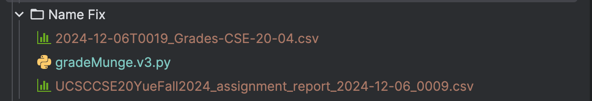
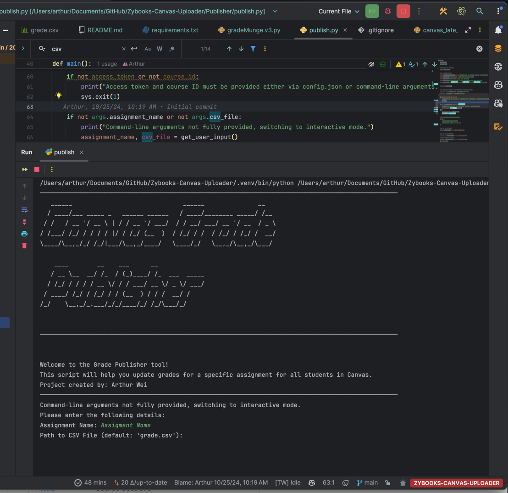

# Notebook to Canvas Grader

This program is designed to help instructors grade assignments from Notebook and publish the grades to Canvas. The tool
processes a CSV file containing student grades and publishes them to the Canvas gradebook.

## Requirements

- **Python 3.x**
- Required Libraries:
    - `pyfiglet`
    - `argparse`
    - `requests`

You can install the required dependencies using the following command:

```bash
pip install -r requirements.txt
```

---

## Usage

### Sanitize CSV File

Before using the main program, you must sanitize the CSV file. This ensures that the student names match correctly
between Zybooks and Canvas, avoiding any issues during grading.

#### Steps to Sanitize the CSV File:

1. **Download the CSV file from notebookgrader:**


2. **Download the CSV file from Canvas:**
    - Navigate to the **Canvas course** and click the **"Grades"** tab in the left sidebar.
      
    - Click the **"Export"** button in the top-right corner and select **"Export Entire Gradebook"** from the dropdown.
      
    - The file will be named with the current year. Move the downloaded file to the **"Name Fix"** directory.

3. **Verify your directory structure:**
    - Ensure the "Name Fix" directory contains both files:
      

4. **Run the sanitization script:**
    - Run the following command:

   ```bash
   python NameFix/gradeMunge.v3.py
   ```

5. **Review the output:**
    - Two new folders will be created in the "Name Fix" directory:
        - **cse30:** Stores the original notebookgrader file as a backup.
        - **output:** Contains the sanitized files.
            - `canvas_graded_output.csv`: The sanitized file ready for Canvas.
            - `unmatched_emails.csv`: Lists emails that could not be matched.
            - `updated_zybooks.csv`: The Zybooks file with updated names.

6. **Prepare the updated file:**
    - Use the `updated_dataset.csv` file for grading.
    - Move or copy the file content into `grade.csv` in the `Publisher/` directory of the project.
      

---

## Main Program: Canvas Publisher

### Config File (`config.json`)

To run the main program, a `config.json` file is required. This file contains the Canvas API access token and course ID.

#### Steps to Create `config.json`:

1. **Get the Canvas API Access Token:**
    - Follow the
      instructions [here](https://community.canvaslms.com/t5/Canvas-Basics-Guide/How-do-I-manage-API-access-tokens-in-my-user-account/ta-p/615312).

2. **Get the Canvas Course ID:**
    - Refer to [this guide](https://13kb.helpscoutdocs.com/article/551-how-to-locate-canvas-course-and-section-id) to
      locate your course ID.

3. **Edit `config.json`:**
    - Add your access token and course ID as follows:

   ```json
   {
     "access_token": "your_canvas_access_token",
     "course_id": "your_course_id"
   }
   ```

4. Save the file in the root directory of the project.

---

### Running the Program

1. Navigate to the `Publisher` directory:

   ```bash
   cd Publisher
   ```

2. Identify the main Python files:
    - **`publish.py`:** Publishes grades to Canvas (main program).

___
4. **Run the main program:**

   ```bash
   python publish.py
   ```

    - Enter the assignment name and the path to the CSV file when prompted. The program defaults to `grade.csv` in the
      `Publisher` directory.
    - Review the output to ensure grades are successfully updated.
      



## Output

The program may generate errors if:

- The assignment name is not found in Canvas.
- The CSV file is missing or improperly formatted.
- A student is not found in the Canvas course.
- Grades fail to update.

---

## Author

Created by Arthur Wei.

